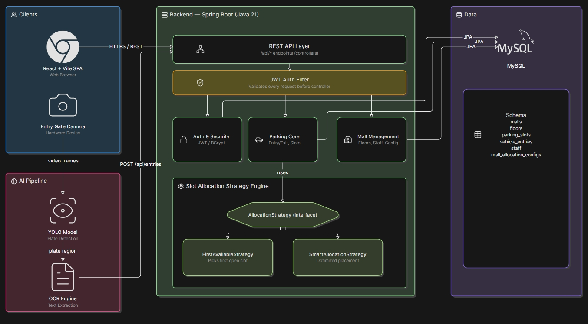

# ParkIQ — Multi-Mall Intelligent Parking Management System

> A multi-tenant parking platform where entry-gate cameras automatically read number plates (YOLO + OCR), the backend instantly allocates the best available slot, and a printed ticket tells the driver exactly where to park — no manual searching required.

---

## Architecture



> For the full written breakdown of every layer, see [ARCHITECTURE.md](./ARCHITECTURE.md).

---

## Tech Stack

| Layer | Technology |
|---|---|
| Backend | Java 21 · Spring Boot 3.4 · Spring Security · Spring Data JPA |
| Auth | JWT (jjwt 0.12.6) · BCrypt |
| Database | MySQL 8 |
| AI / Vision | YOLO (plate detection) + OCR Engine |
| Frontend | React 19 · Vite · React Router · Axios · Recharts |
| API Docs | SpringDoc OpenAPI (Swagger UI) |
| Build | Maven (backend) · npm (frontend) |

---

## Key Features

### 🤖 Automated Vehicle Entry via AI
The entry-gate camera captures the vehicle, YOLO detects the number plate region, and an OCR engine extracts the text. The plate number is sent to the backend — no human typing needed.

### 🅿️ Smart Slot Allocation (Strategy Pattern)
Two pluggable strategies decide which slot a car gets:
- **First-Available** — simple fallback, picks the first open slot.
- **Smart Allocation** — Admin-configured rules (e.g. prefer ground floor, fill top-down). Chosen automatically when an active config exists for the mall.
Slots are fetched with a **pessimistic database lock** to prevent two cars ever being assigned the same spot under concurrent load.

### 🏬 True Multi-Tenancy (Multiple Malls)
One deployment serves any number of malls. Each mall is fully isolated: its own floors, slots, staff, and allocation config. A Super Admin onboards malls and assigns their Admin; data never leaks across tenants.

### 👥 Three-Tier Role System
| Role | What they do |
|---|---|
| **Super Admin** | Register malls, create Admin accounts, activate/deactivate malls |
| **Admin** | Design parking layout (floors + slots), manage Officers, configure allocation strategy, monitor live dashboard |
| **Officer** | Register vehicle entries & exits manually (fallback when camera fails), view live slot availability |

### 🔄 Live Slot Polling
The Officer dashboard auto-refreshes slot availability every 30 seconds — officers always see the real-time picture without a manual reload.

### 🛡️ Unified Security Layer
Every route is JWT-protected. `JwtAuthFilter` validates tokens on every request. Role-based access is enforced at the route level in both the backend (`SecurityConfig`) and the frontend (`ProtectedRoute`).

---

## Getting Started

### Prerequisites
- Java 21+
- Maven 3.9+
- MySQL 8 running locally
- Node.js 18+ & npm

---

### 1. Database Setup

```sql
CREATE DATABASE parking_db;
CREATE USER 'root'@'localhost' IDENTIFIED BY 'password';
GRANT ALL PRIVILEGES ON parking_db.* TO 'root'@'localhost';
FLUSH PRIVILEGES;
```

---

### 2. Backend

```bash
cd parking-backend

# Run with Maven wrapper (schema auto-creates on first run)
./mvnw spring-boot:run
```

- API base URL: `http://localhost:8080/api`
- Swagger UI: `http://localhost:8080/api/swagger-ui.html`

> **Default Super Admin** is seeded automatically on first startup by `DataSeeder`. Check the seeder class for the default credentials.

---

### 3. Frontend

```bash
cd parking-frontend
npm install
npm run dev
```

- App runs at: `http://localhost:5173`
- Points to backend at `http://localhost:8080/api` (configured in `.env`)

---

## API Reference

Base path: `/api` · All endpoints (except `/auth/login`) require `Authorization: Bearer <token>`

### Auth

| Method | Endpoint | Body | Description |
|---|---|---|---|
| `POST` | `/auth/login` | `{ username, password }` | Returns JWT token + role |

---

### Malls *(Super Admin only)*

| Method | Endpoint | Description |
|---|---|---|
| `GET` | `/malls` | List all malls |
| `POST` | `/malls` | Register a new mall |
| `PATCH` | `/malls/{id}/status` | Activate / deactivate a mall |

---

### Floors *(Admin)*

| Method | Endpoint | Description |
|---|---|---|
| `GET` | `/floors/mall/{mallId}` | Get all floors for a mall |
| `POST` | `/floors` | Create a new floor |

---

### Parking Slots *(Admin)*

| Method | Endpoint | Description |
|---|---|---|
| `GET` | `/slots/mall/{mallId}` | Get all slots for a mall |
| `GET` | `/slots/floor/{floorId}` | Get slots by floor |
| `POST` | `/slots` | Create a new slot |
| `PATCH` | `/slots/{id}/status` | Update slot status |

---

### Vehicle Entries *(Officer)*

| Method | Endpoint | Body | Description |
|---|---|---|---|
| `POST` | `/entries` | `{ vehicleNumber, mallId }` | Register vehicle entry → returns assigned slot |
| `POST` | `/entries/{id}/exit` | — | Process vehicle exit, frees the slot |
| `GET` | `/entries/mall/{mallId}/active` | — | List all currently active entries for a mall |

---

### Staff *(Super Admin / Admin)*

| Method | Endpoint | Description |
|---|---|---|
| `GET` | `/staff` | List all staff (scoped by role) |
| `POST` | `/staff` | Create Admin or Officer account |
| `PATCH` | `/staff/{id}/status` | Enable / disable a staff account |
| `POST` | `/staff/change-password` | Change own password |

---

### Allocation Config *(Admin)*

| Method | Endpoint | Description |
|---|---|---|
| `GET` | `/allocation-config/mall/{mallId}` | Get active allocation config |
| `POST` | `/allocation-config` | Create / update allocation config (enables Smart Strategy) |

---

> 📖 Full interactive API docs with request/response schemas available at **`/api/swagger-ui.html`** when the backend is running.